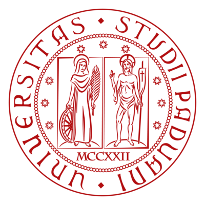
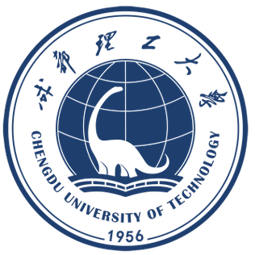
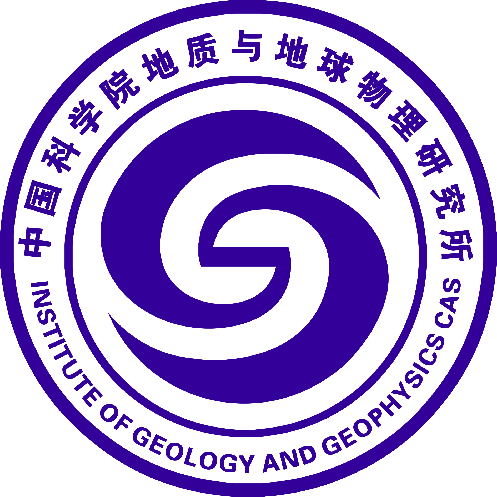

I am an associate researcher with the [College of Geophysics at Chengdu University of Technology (CDUT)](https://www.cdut.edu.cn/en/) . Before joining CDUT, I completed a two-year postdoctoral research program at [Peking University (PKU)](https://english.pku.edu.cn/) in 2022. I obtained my PhD in Solid Earth Physics in 2020 from [Institute of Geology and Geophysics, Chinese Academy of Sciences (IGGCAS)](http://english.igg.cas.cn/), and BE in Applied Geophysics in 2014 from [Jilin University (JLU)](https://jlu.edu.cn/).

I am currently a visiting scientist at [University of Padua (UNIPD)](https://www.unipd.it/en/), working with Prof. [Manuele Faccenda](https://scholar.google.com/citations?user=cF3kRg0AAAAJ&hl=en&oi=ao) on seismic anisotropy tomography methods.

**My research interests include:**
- Observational seismology
- Signal Processing in Seismology
- Imaging of seismic Anisotropy
- Structure, evolution, and deformation of continental lithosphere

  
  
  
  
  

